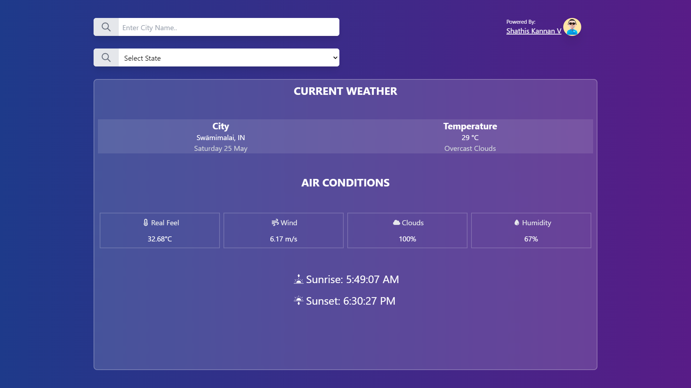

# Weather Forcast Dashboard built with React and Open Weather API 2.5

This project is a weather forecast application built with React.js, leveraging the OpenWeather API 2.5 to provide current and forecasted weather data.

## The Application



## Demo

Check out the live demo of the application: [Weather Forecast App Demo](https://shanofre-weather-app.netlify.app/)


## Project Structure

```plaintext
weather-forecast-app/
├── public/
├── src/
│   ├── components/
│   │   ├── dashboard/
│   │   │   ├── Dashboard.jsx
│   │   │   ├── DailyForecast.jsx
│   │   │   ├── CommonLoader.jsx
│   │   │   ├── utility/
│   │   │   │   ├── DateConverter.js
│   ├── App.js
│   ├── index.js
│   ├── ...
├── .env
├── package.json
├── README.md
```

## Installation

To get started with this project, follow these steps:

1. **Clone the repository:**

    ```bash
    git clone https://github.com/ShathisKannan19/weather-dashboard-app.git
    cd weather-dashboard-app
    ```

2. **Install dependencies:**

    Ensure you have [Node.js](https://nodejs.org/) installed. Then run:

    ```bash
    npm install
    ```

3. **Set up OpenWeather API key:**

    Create a `.env` file in the root directory and add your OpenWeather API key:

    ```env
    REACT_APP_API_KEY=your_openweather_api_key
    ```

4. **Run the application:**

    ```bash
    npm start
    ```

    This will start the development server, and you can view the application at `http://localhost:3000`.

## Project Components

### Dashboard

The `Dashboard` component is the main container for the weather forecast information. It fetches data from the OpenWeather API and displays it.

- **File:** `Dashboard.jsx`
- **Path:** `src/components/dashboard/Dashboard.jsx`

### Daily Forecast

The `DailyForecast` component displays the daily weather forecast.

- **File:** `DailyForecast.jsx`
- **Path:** `src/components/dashboard/DailyForecast.jsx`

### Common Loader

The `CommonLoader` component shows a loading spinner while data is being fetched.

- **File:** `CommonLoader.jsx`
- **Path:** `src/components/dashboard/CommonLoader.jsx`

### Utility - Date Converter

The `DateConverter` utility provides functions to format and convert date strings.

- **File:** `DateConverter.js`
- **Path:** `src/components/dashboard/utility/DateConverter.js`

## Additional Notes

- Ensure you network while you using this Application because we are working with API of OpenWeather API 2.5